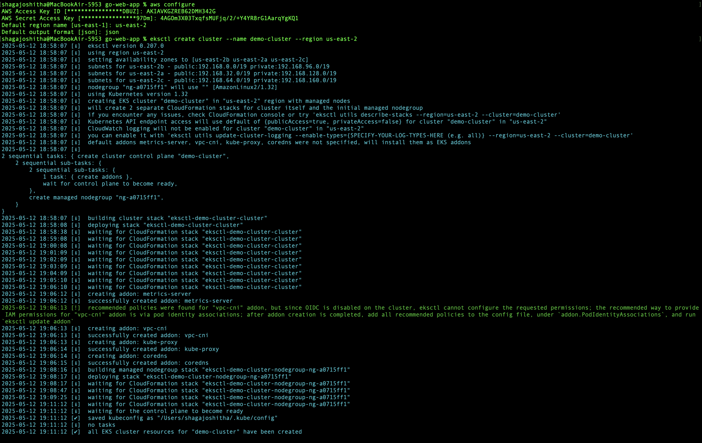
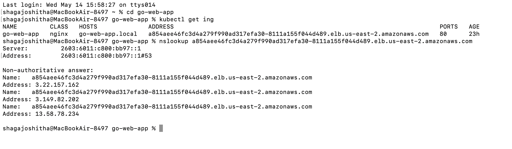
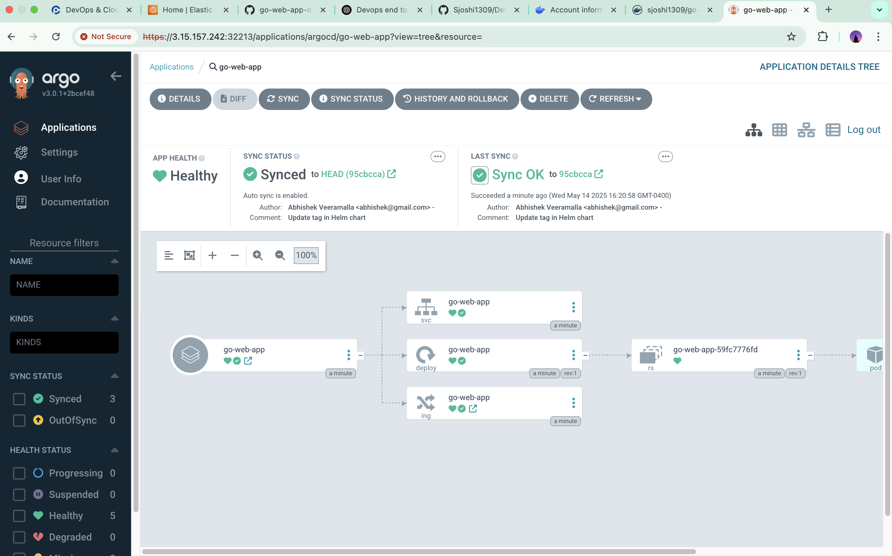

# Full Stack DevOps Implementation on AWS EKS: Go App + CI/CD with GitHub Actions & Argo CD

This project demonstrates a complete DevOps lifecycle implementation for a Golang web application — from source code to deployment on AWS EKS using industry-standard tools like Docker, GitHub Actions, Argo CD, and Helm.

##  Key Features

- Multi-stage Docker build for lean and secure images
- Kubernetes manifests for deployment configuration
- GitHub Actions for Continuous Integration (CI)
- Argo CD for GitOps-based Continuous Delivery (CD)
- Helm charts for multi-environment support
- AWS EKS for scalable container orchestration
- Ingress controller setup for external access
- DNS mapping for custom domain routing

##  Tools & Technologies Used

| Category             | Tools & Services                         |
|----------------------|-------------------------------------------|
| Language             | Golang                                    |
| Containerization     | Docker (multi-stage builds)               |
| CI                   | GitHub Actions                            |
| CD                   | Argo CD (GitOps delivery)                 |
| Orchestration        | Kubernetes (AWS EKS)                      |
| Packaging            | Helm Charts                               |
| Code Quality         | golangci-lint (v1.56.2)                   |
| Networking           | Ingress-NGINX                             |
| Domain Routing       | DNS (e.g., Route 53 or external provider) |


##  CI/CD Workflow

1. **CI with GitHub Actions**
   - Triggered on every push or pull request to the `main` branch
   - Runs `golangci-lint` for static code analysis
   - Builds a Docker image and pushes it to Docker Hub

2. **CD with Argo CD**
   - Watches GitHub repo for changes to Helm charts or Kubernetes manifests
   - Syncs updated config to AWS EKS
   - Handles deployment rollout, rollback, and health monitoring via GitOps
##  Project Structure

```bash
.
├── .github/workflows/ci.yaml         # GitHub Actions CI pipeline
├── Dockerfile                        # Multi-stage build for Go app
├── go.mod / go.sum                   # Go dependencies
├── main.go                           # Entry point
├── k8s/
│   ├── manifests/
│   │   ├── deployment.yaml
│   │   ├── service.yaml
│   │   └── ingress.yaml
├── helm/
│   └── go-web-app-chart/             # Helm chart with templates
│       ├── templates/
│       └── values.yaml
```
##  Deployment Instructions
### 1. Set Up the Go Web Application
- Wrote a simple web application in Golang
- Verified the app locally using using go 'http://localhost:8080/courses'
  
### 2. Containerization with Docker
- Created a **multi-stage Dockerfile** to optimize the image
- First stage used `golang:1.22` for building the binary
- Second stage used `distroless` for a secure, minimal runtime
- Built and tested the image locally using:
  ```bash
  docker build -t sjoshi1309/go-web-app:v1 .
  ```
### 3. Push Docker Image to Docker Hub
- Tagged the Docker image properly:
  ```bash
  docker tag go-web-app sjoshi1309/go-web-app:v1
  ```
- Logged into Docker Hub and pushed:
  ```bash
  docker push sjoshi1309/go-web-app:v1
  ```
### 4. Create Kubernetes Manifests
 
Wrote Kubernetes YAML files for:
- Deployment (`deployment.yaml`)
- Service (`service.yaml`)
- Ingress (`ingress.yaml`)
- Used `NodePort` for early-stage testing
  
### 5. Installed kubectl, eksctl, and AWS CLI
- Installed and configured the AWS CLI with IAM credentials
- Used eksctl to provision an EKS cluster in `us-east-1` region
  
 

### 6. Helm Chart Packaging

- Converted raw manifests into a **Helm chart**
- Configured `values.yaml` for different environments
- Deployed the Helm chart using:
  ```bash
  helm install go-web-app ./helm/go-web-app-chart
  ```
### 7. Ingress + DNS Mapping

- Installed and configured **NGINX Ingress Controller**
- Created an Ingress resource to route external traffic to the app
- Mapped a domain using manual DNS mapping for testing
- Accessed the app via:
  ```
  http://3.15.157.242:32213/courses
  ```
  
  
### 8. CI with GitHub Actions
Set up a workflow in `.github/workflows/ci.yaml` to:
- Checkout code
- Set up Go environment (v1.22.2)
- Run `golangci-lint` (v1.56.2) for code quality
- Build and push Docker image to Docker Hub

### 9. CD with Argo CD
- Installed Argo CD in the Kubernetes cluster
- Exposed Argo CD using `NodePort` (with `--insecure` flag for development)
- Created an Argo CD application pointing to the GitHub repo
- Argo CD automatically synced updated Helm charts and deployed the app to EKS
  
## Final Testing
Verified the deployment via Argo CD UI and kubectl

Validated logs, service accessibility, and Ingress routing

Completed full CI/CD validation from PR to deployment

Made a small content change in home.html (updated the text from “Learn DevOps from Basics” to “My Journey to Learn DevOps from Basics”

Pushed the change to GitHub, and the rest of the process was handled entirely by the CI/CD pipeline:
- The updated image tag was automatically reflected in the Helm chart’s values.yaml

- GitHub Actions triggered the CI pipeline to build a new Docker image and push it to Docker Hub

- Argo CD detected the change and automatically synced the new version to the EKS cluster

- The updated application was live on the website within seconds — fully automated through the DevOps setup
  


##  Issues Faced & How I Solved Them

- **kubectl authentication issues**: Faced credential-related errors while connecting to the EKS cluster due to misconfigured AWS CLI and IAM roles. Resolved it by switching to an IAM user, regenerating access keys, and reconfiguring the AWS CLI.

- **ImagePullBackOff errors**: Encountered frequent `ImagePullBackOff` errors in Kubernetes due to mismatches between image platform compatibility (built on macOS but deployed on Linux). Solved it by using multi-arch compatible Docker builds and verifying public visibility and tags in Docker Hub.

- **Go version and golangci-lint compatibility issues**: GitHub Actions runners used Go 1.23 (beta), which was unsupported by `golangci-lint`. Fixed this by pinning Go to version `1.22.2` and manually installing `golangci-lint v1.56.2` to ensure compatibility.

_Each challenge reinforced my understanding of cross-platform deployment, CI/CD debugging, and toolchain alignment in real-world DevOps environments._

##  Outcome
Every code push triggers linting, Docker build, and image push via GitHub Actions
 
Argo CD auto-syncs changes and deploys to EKS

Application is available via public IP or custom domain with Ingress

_🚀 This project is more than just pipelines and deployments — it represents my journey of learning, debugging, and building real-world DevOps skills from the ground up by truly understanding every step of the DevOps journey._

